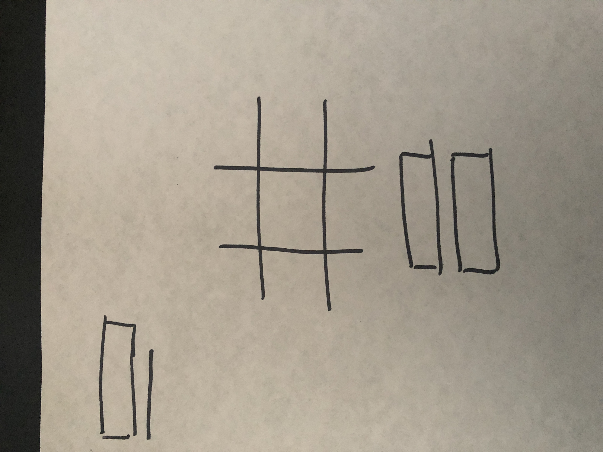

# Tic Tac token

This application is a simple game of Tic Tac Toe. First player will be X and
alternate moves between second player as O. You shall see results and messaging
in the top left hand corner. New Game will clear the board for a new game.

## [Deployed Link to Game](https://ryansalandy.github.io/tic-tac-toe-client/)

## Planning

### User Stories

- As a user I want to sign up/in
- As a user I want to sign out
- As a user I want to know if signed in
- As a user I want to start a new game
- As a user I want to now whos turn it is
- As a user I want to now who won

### Wireframe

